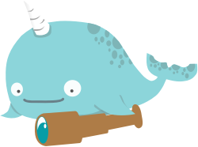

# Monoskope



| `main` | `develop` |
| -- | -- |
|[](https://gitlab.figo.systems/platform/monoskope/monoskope/-/commits/main)|[](https://gitlab.figo.systems/platform/monoskope/monoskope/-/commits/develop)
|[](https://gitlab.figo.systems/platform/monoskope/monoskope/-/commits/main)|[](https://gitlab.figo.systems/platform/monoskope/monoskope/-/commits/develop)|

`Monoskope` implements the management and operation of tenants, users and their roles in a [Kubernetes](https://kubernetes.io/) multi-cluster environment. It fullfills the needs of operators of the clusters as well as the needs of developers using the cloud infrastructure provided by the operators.

## Further documentation

Find the detailed documentation at [/docs](docs/Overview.md).

## Development

When developing, the `Makefile` comes in handy to help you with various tasks.
There are specific `*.mk` files for things like helm, kind, go, etc. which provides targets for developing with those tools.

The following example renders the `monoskope` helm chart:

```sh
$ make helm-template
==> Linting build/package/helm/monoskope
[INFO] Chart.yaml: icon is recommended

1 chart(s) linted, 0 chart(s) failed

wrote tmp/monoskope/charts/dex/templates/serviceaccount.yaml
wrote tmp/monoskope/charts/dex/templates/secret.yaml
wrote tmp/monoskope/charts/dex/templates/service.yaml
wrote tmp/monoskope/charts/dex/templates/deployment.yaml
```

The following targets are defined. Please not that there are variables (uppercase) which can be overriden:

| target | Description |
| --------- | ----------- |
| *general* | |
| `clean` | Cleans everything, tools, tmp dir used, whatever |
| `diagrams` | Generates mermaidjs diagrams below `docs/flow-charts` |
| `tools` | Install necessary tools to `TOOLS_DIR`, like `kind`, `ginkgo`, `golangci-lint`, ... |
| `tools-clean` | Removes the tools |
| `echo-<VARIABLENAME>` | Echos the content of `<VARIABLENAME>` |
| *helm* | |
| `helm-add-kubism` | Add the kubism helm repository to the local list of repos |
| `helm-template-<CHARTNAME>` | Templates the helm chart `<CHARTNAME>` to `HELM_OUTPUT_DIR/<CHARTNAME>` |
| `helm-install-<CHARTNAME>` | Installs the helm chart `<CHARTNAME>` to namespace `KUBE_NAMESPACE` with your current `kubecontext` and `HELM` |
| `helm-install-from-repo-<CHARTNAME>` | Installs the helm chart `<CHARTNAME>` to namespace `KUBE_NAMESPACE` from `HELM_REGISTRY_ALIAS` in version `VERSION` |
| `helm-uninstall-<CHARTNAME>` | Uninstalls the helm chart `<CHARTNAME>` from namespace `KUBE_NAMESPACE` |
| `helm-clean` | Clears `HELM_OUTPUT_DIR` |
| `helm-dep-<CHARTNAME>` | Does a helm dep update for `<CHARTNAME>` |
| `helm-lint-<CHARTNAME>` | Does a helm lint for `<CHARTNAME>` |
| `helm-update-chart-deps` | Updates the `monoskope` chart dependencies to monoskope subchart to `VERSION` |
| `helm-package-<CHARTNAME>` | Does a helm package for `<CHARTNAME>` |
| `helm-push-<CHARTNAME>` | Pushes the helm chart for `<CHARTNAME>` |
| *go* | |
| `go-mod` | Downloads all require go modules |
| `go-fmt` | Formats all `*.go` files |
| `go-vet` | Vets all go code |
| `go-lint` | Lints all go code |
| `go-run-*` | Runs the app in `cmd/*`, e.g. `go-run-monoctl` to run `monoctl` from sources |
| `go-test` | Runs all go tests |
| `go-protobuf` | Generates code for all proto specs in `api` folder and it's children |
