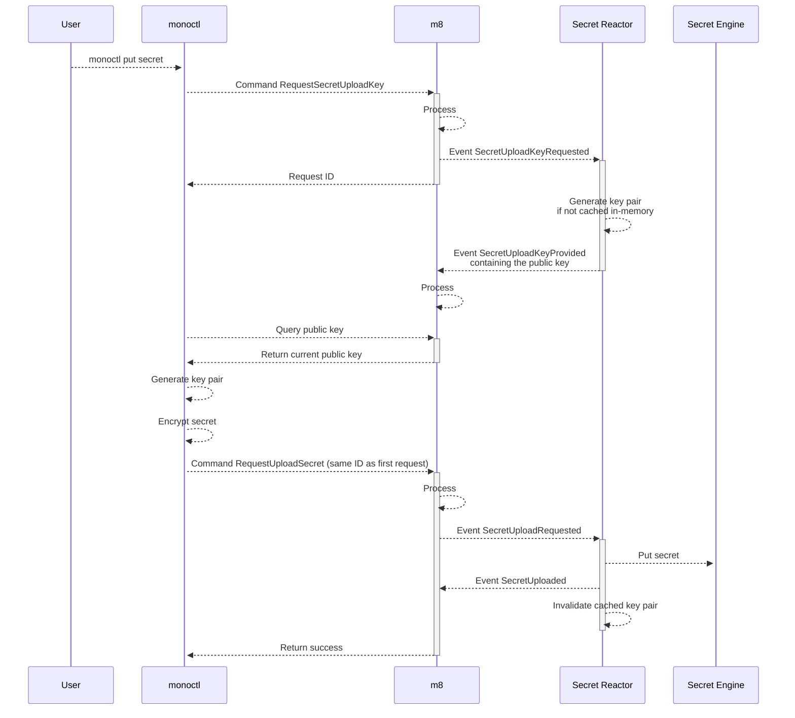

# ADR-3: Secret Management

## Context

Monoskope should provide functionality to let users manage secrets in upstream secret stores e.g. [Hashicorp Vault](https://www.vaultproject.io/).
**m8 itself won't store secrets**.

Uploading secrets has to be highly secure and m8 itself should not have access to the secrets or only for the short timeframe of storing it upstream.
Additionally we do not want to expose secrets to users, but show them a hash of it to make it comparable.

m8 should support multiple upstream secrets stores which will be implemented as different reactors which interact with them.

## Proposals

### Security #SEC1

* A one-time key pair generated by `monoctl` client-side will be used by `monoctl` to encrypt secrets before they are sent to m8
* `monoctl` furthermore uses a public key provided by m8 API to encrypt the secrets against
* The public key of the client-side key pair will be sent along with the encrypted secret
* Reactor's have the private key to decrypt the secret payload to be able to store it upstream
* The public/private key pair of m8 will be rotated frequently to prevent that secrets stored in m8 can be read after they have been stored upstream

#### Pros

* Secrets are never in clear text anywhere

#### Cons

* Secrets are stored as part of events in the `EventStore` (temporarily) readable to m8
* Due to the nature of event sourcing these events stay forever (even though the private key is rotated and the secrets won't be readable anymore)
* The setup is relatively complex
* There is still a timeframe where m8 itself actually stores the secrets event though they will be unreadable

### Enhancement of security #SEC1-ENH1

If a user want's to upload a secret, the server-side key pair is generated only for this single use-case and discarded after the secret has been successfully stored in the upstream secret store.
This shortens the timeframe m8 itself has a stored readable version of the secret.

#### Cons

* This makes the handling of the server-side key slightly more complex

### Enhancement of security #SEC1-ENH2

The secret payload is not stored as part of the event but is stored within a cache (e.g. Redis) for the time the request of storing it upstream is processed in m8.
The entry has a TTL and if Monoskope doesn't manage to store it upstream in time it fails.
The events only have a reference to this cached entry.
This way the secrets are not stored anywhere anymore after successful upload into the upstream store.

#### Cons

* Does not fit the EventSourcing architecture.

### API Design #APID1

* The API has different proto message types for different upstream secret providers to reflect differences between them
* Hashes have to be equal no matter what the upstream secret store is
* Secrets stores have to be activated/deactivated by system admins so that m8 can show a list of supported secret stores available along
* Secrets stores have a unique name which not necessarily reflects the type of the upstream secret store
* The first store added becomes the default store, this can be adjusted if there are more than one store
* Users have to provide which upstream store they target if they do not wan't the default store
* IDs of uploaded secrets are URIs, e.g. `mysecretstore://app/some/path` where the protocol is the secret store to upload the secret to
* The encrypted payload is simple json where values are base64 encoded

## Diagram

In the following diagram the term "m8" is used for all parts of the control plane for handling commands/events.
Even though single parts of the control plane which are of special interest for this diagram are shown separately.

## Decision

* We take #SEC1 + #SEC1-ENH1 + #APID1.
* #SEC1-ENH2 is considered as not fitting the architecture and would things complicate much more
  
## Status

Accepted
