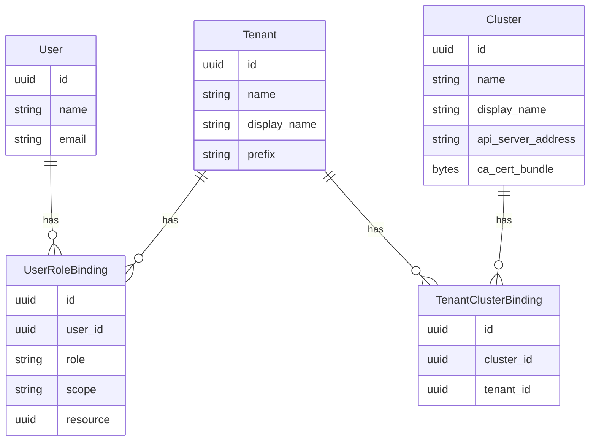

# Monoskope Data Model

```mermaid
erDiagram
    User {
        uuid id
        string name
        string email
    }

    UserRoleBinding {
        uuid id
        uuid user_id
        string role
        string scope
        uuid resource
    }

    Cluster {
        uuid id
        string name
        string display_name
        string api_server_address
        bytes ca_cert_bundle
    }

    Tenant {
        uuid id
        string name
        string display_name
        string prefix
    }

    TenantClusterBinding {
        uuid id
        uuid cluster_id
        uuid tenant_id
    }

    User ||--o{ UserRoleBinding : has
    Tenant ||--o{ UserRoleBinding : has

    Tenant ||--o{ TenantClusterBinding : has
    Cluster ||--o{ TenantClusterBinding : has

```