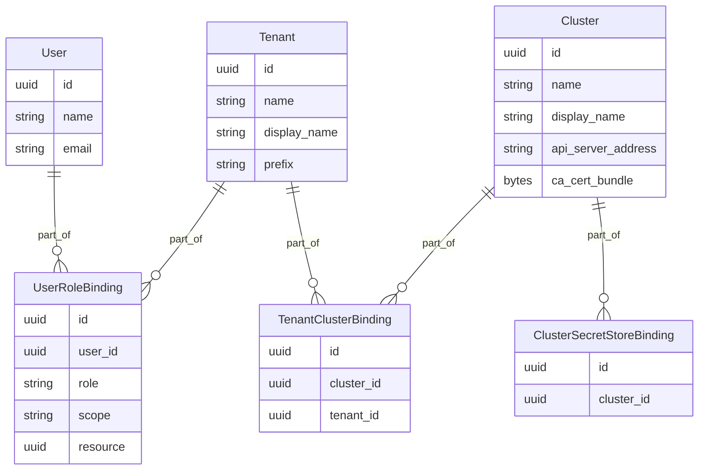

# Monoskope Data Model

While m8 has no classic CRUD database with tables for storing state, the transient state built based on that has.
Here is how the projected transient state is modeled:

```mermaid
erDiagram
    User {
        uuid id
        string name
        string email
    }

    UserRoleBinding {
        uuid id
        uuid user_id
        string role
        string scope
        uuid resource
    }

    Cluster {
        uuid id
        string name
        string display_name
        string api_server_address
        bytes ca_cert_bundle
    }

    Tenant {
        uuid id
        string name
        string display_name
        string prefix
    }

    TenantClusterBinding {
        uuid id
        uuid cluster_id
        uuid tenant_id
    }

    ClusterSecretStoreBinding {
        uuid id
        uuid cluster_id
    }

    User ||--o{ UserRoleBinding : part_of
    Tenant ||--o{ UserRoleBinding : part_of

    Tenant ||--o{ TenantClusterBinding : part_of
    Cluster ||--o{ TenantClusterBinding : part_of

    Cluster ||--o{ ClusterSecretStoreBinding : part_of
```
