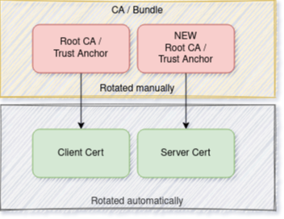

**[[Back To Overview]](../README.md)**

---

# Monoskope Certificate Management

## Prerequisites

* [step-cli](https://smallstep.com/cli/) installed locally
* [cert-manager](https://cert-manager.io) running in target cluster
* [OPTIONAL] [Vault](https://www.vaultproject.io/) accessible by `cert-manager`

## Overview


Monoskope needs it's own [PKI](https://en.wikipedia.org/wiki/Public_key_infrastructure) because components like the `m8 Operator` use [mTLS](https://en.wikipedia.org/wiki/Mutual_authentication) to communicate and authenticate with the `Monoskope Control Plane (m8CP)`.

First this document shows how the chain looks like and how it works.
After that the manual on how to set up everything is explained.

## So what does the cert chain look like?

Good you ask! Certificate chains can really mess with your head. Have a look at the following diagram:


At the root of everything sits our `Trust Anchor (TA)` as we call it.
The `TA` is a self signed certificate [you create](#create-a-trust-anchor) and provide to the `m8CP`.
Monoskope utilizes `cert-manager` and uses it as root `CA` based on the `TA` you provide.

Now with the `CA` in place, we can issue server and client certificates.

### What about the rotation of the `Trust Anchor`?

Now we come to the part which is not automated.
The `TA` will expire based on what you've configured when creating the certificate.
Now what? Let's have a look at the following diagram:



With a buffer of at least 30 days you want to rotate the `TA`.
You create a [new certificate](#rotating-the-trust-anchor) like you did initially for the `TA`.
But now you bundle the old and the new certificate together and make this bundle available to the `m8CP`.

Now with the bundle in place certificate chains can have the old or the new `TA` as root.
This is not an issue since every chain can still be validated no matter which `TA` has been used.
Now this bundle has to stay until **every** server and client certificate has been rotated. Only after that point it is safe to remove the old `TA` from the bundle.

## Create a trust anchor

Create a root CA certificate which we call the trust anchor:

```bash
step certificate create root.monoskope.cluster.local ca.crt ca.key \
  --profile root-ca --no-password --insecure --not-after=87600h
```

This trust anchor must be made available to [cert-manager](https://cert-manager.io) to let it issue certificates based on that trust anchor.

This can be done in two ways:

* via the [CA issuer](https://cert-manager.io/docs/configuration/ca/)
* via the [Vault issuer](https://cert-manager.io/docs/configuration/vault/)

### Using the CA issuer

If you're using the CA Issuer you have to set the following in the `values.yaml` when deploying Monoskope:

```yaml
pki:
  enabled: true
  issuer:
    ca:
      enabled: true
      existingTrustAnchorSecretName: "monoskope-trust-anchor" # name of secret in K8s where you have to provide the root ca
```

Create secret containing the generated trust anchor as in the namespace you're about to deploy Monoskope:

```bash
kubectl -n monoskope create secret tls monoskope-trust-anchor --cert=ca.crt --key=ca.key
```

After storing the trust anchor in a K8s secret you can delete your local copy or store it in a save location.

### Using the Vault issuer

> This part has not been documented yet. Feel free to create a PR/MR.

## Issuing mTLS certificates

When issuing certificates for components like the m8 Operator there are some expectations which must be met:

1. The `commonName` must be a subdomain of `monoskope.cluster.local`, e.g. `operator.monoskope.cluster.local`. It should be unique throughout the system.
1. Set `X509v3 Subject Alternative Name` DNS to the same as for `commonName` and add a unique email address as user information, e.g.:

    ```bash
    DNS:operator.monoskope.cluster.local, email:operator@monoskope.io
    ```

1. Set the organization to `Monoskope`.

See the default operator auth `cert-manager` certificate resource definition for this.
This will be deployed along with the m8 control plane:

```yaml
apiVersion: cert-manager.io/v1alpha3
kind: Certificate
metadata:
  name: m8dev-monoskope-mtls-operator-auth
  namespace: platform-monoskope-monoskope
spec:
  commonName: operator.monoskope.cluster.local
  dnsNames:
  - operator.monoskope.cluster.local
  emailSANs:
  - operator@monoskope.io
  issuerRef:
    kind: Issuer
    name: m8dev-monoskope-root-ca-issuer
  secretName: m8dev-monoskope-mtls-operator-auth
  subject:
    organizations:
    - Monoskope
  usages:
  - client auth
```

## Rotating the trust anchor

Rotating the trust anchor without downtime is a multi-step process:
you must generate a new trust anchor, bundle it with the old one, rotate all certificates derived from the old one, and finally remove the old trust anchor from the bundle.

Create a new trust anchor:

```bash
step certificate create root.monoskope.cluster.local ca-new.crt ca-new.key \
  --profile root-ca --no-password --insecure
```

Create Bundle with old and new CA cert:

```bash
step certificate bundle ca-new.crt ca-old.crt bundle.crt
```
