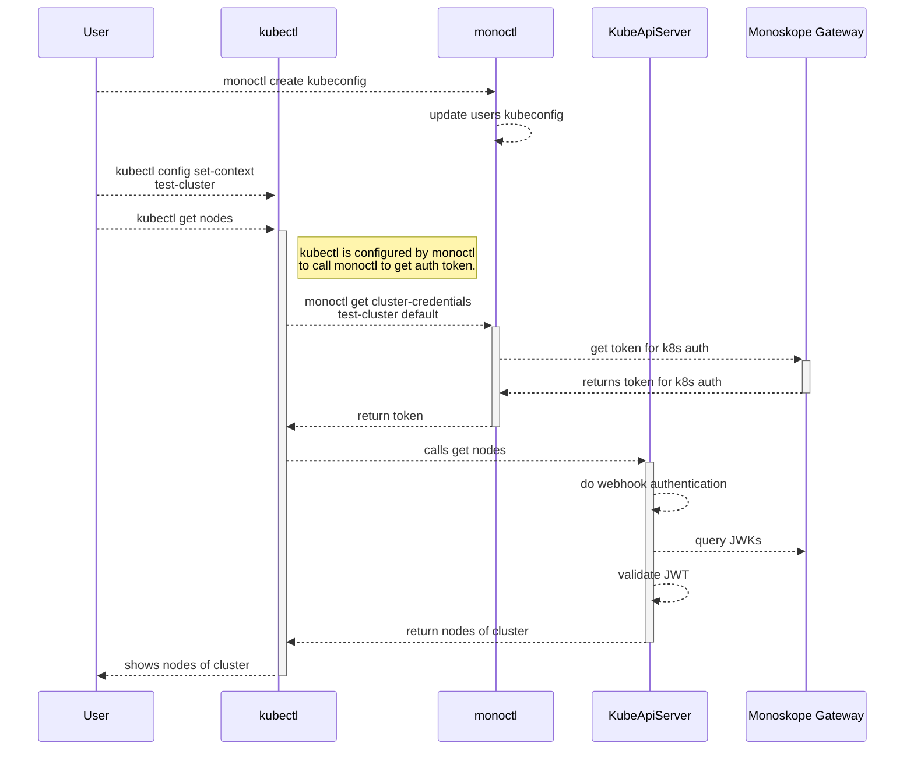

**[[Back To Overview]](../README.md)**

---

# Kubernetes Authentication

Monoskope can be utilized as an OAuth2 provider to authenticate with Kubernetes clusters via [OpenID Connect](https://openid.net/connect/).
See the official docs of [Kubernetes authentication](https://kubernetes.io/docs/reference/access-authn-authz/authentication/#openid-connect-tokens) to find additional information on the topic.
The following diagram shows how the authentication flow looks like when Monoskope comes into play:



* `monoctl` eventually does it's normal authentication flow when `kubectl` is used to get nodes.
This depends on the current authentication state of `monoctl`.
If a token is available which hasn't expired yet, no authentication flow is necessary here.
* `monoctl cluster auth` call may return immediately without talking to the control plane if there is a cached token available.

## You have control over the KubeAPIServer

If you have control over your KubeAPIServer refer to the [official docs](https://kubernetes.io/docs/reference/access-authn-authz/authentication/#configuring-the-api-server) of Kubernetes for detailed explanation.
To enable Monoskope as OAuth2 provider, configure the following flags on the API server:

* Set Monoskope as the issuer:

    `--oidc-issuer-url "https://api.monoskope.your-domain.io"`

* Tokens issued by Monoskope will have `k8sauth' as the audience:

    `--oidc-client-id "k8sauth"`

* Claim containing the user name:

    `--oidc-username-claim cluster_username`

* Claim containing the role/group:

    `--oidc-groups-claim cluster_role`

* Claim which must be present in the token. Prohibits valid tokens for different cluster used to auth:

    `--oidc-required-claim cluster_name=your_cluster`

## You are using SAP Gardener

If you're using SAP Gardener you might not be able to directly configure this on the KubeAPIServer, but there are different ways to do this:

* [ClusterOpenIDConnectPreset](https://github.com/gardener/gardener/blob/master/docs/usage/openidconnect-presets.md#clusteropenidconnectpreset) and [OpenIDConnectPreset](https://github.com/gardener/gardener/blob/master/docs/usage/openidconnect-presets.md#openidconnectpreset) resources can be used.
* Shoots can be configured directly via the `core.gardener.cloud/v1beta1/Shoot` [resource](https://github.com/gardener/gardener/blob/master/example/90-shoot.yaml#L137).

The configuration for both is pretty similar for both cases.
If you're configuring it directly via the Gardener Shoot resource the following has to be at `spec.kubernetes.kubeAPIServer.oidcConfig`.
When you're using the Presets this has to be put under `spec.server`.

```yaml
issuerURL: "https://api.monoskope.your-domain.io"
clientID: k8sauth
usernameClaim: cluster_username
groupsClaim: cluster_role
requiredClaims:
    cluster_name: your_cluster
caBundle: |-
    #   -----BEGIN CERTIFICATE-----
    #   CA which issues the cert for https://api.monoskope.your-domain.io
    #   -----END CERTIFICATE-----
```
