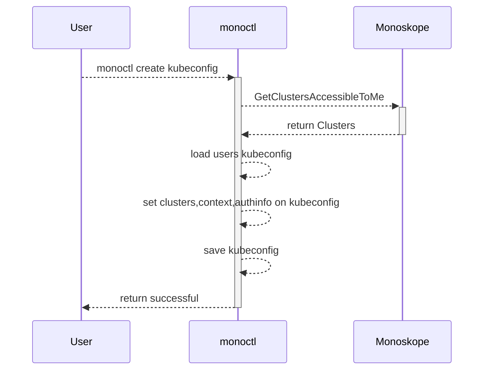

# `monoctl create kubeconfig`

## General assumptions

* `monoctl create kubeconfig` adds/updates all clusters which are accessible to the user authenticated to the users kubeconfig.
* No auth token is stored in the kubeconfig by this command.
* Authentication happens when the user uses a kubecontext configured by m8 using [client-go-credential-plugins](https://kubernetes.io/docs/reference/access-authn-authz/authentication/#client-go-credential-plugins) authentication.
See the sequence diagram [here](cluster-auth-flow.md).

## Useful links

* K8s docs on [client-go-credential-plugins](https://kubernetes.io/docs/reference/access-authn-authz/authentication/#client-go-credential-plugins).
* [zalando/go-keyring](https://github.com/zalando/go-keyring)
