**[[Back To Overview]](.)**

# Cluster Authentication Flow

```mermaid
sequenceDiagram
    participant U as User
    participant K as kubectl
    participant m8ctl as monoctl
    participant A as KubeApiServer
    participant W as WebhookAuthenticator
    participant G as Gateway
    participant Q as QueryHandler
    U-->>+K: kubectl config set-context \<br>test-cluster
    U-->>+K: kubectl get nodes
    K-->>+m8ctl: monoctl cluster auth \<br>test-cluster jane.doe default
    m8ctl-->>+G: get token for k8s auth
    G-->>+Q: get user’s roles
    G-->>G: validate if user is authorized to access cluster
    G-->>-m8ctl: returns token for k8s auth
    m8ctl-->>-K: return token
    K-->>+A: calls get nodes
    A-->>+W: do webhook authentication
    W-->>G: query JWKs
    W-->>W: validate JWT
    W-->>-A: authorize
    A-->>-K: return nodes of cluster
    K-->>-U: shows nodes of cluster
```

## General assumptions

* `monoctl` eventually does it's normal authentication flow when `kubectl` is used to get nodes.
This depends on the current authentication state of `monoctl`.
If a token is available which hasn't expired yet, no authentication flow is necessary here.
* `monoctl cluster auth` call may return immediately without talking to the control plane if there is a cached token available.

## Useful links

* K8s docs on [client-go-credential-plugins](https://kubernetes.io/docs/reference/access-authn-authz/authentication/#client-go-credential-plugins).
* Information on [JWKs](https://auth0.com/docs/tokens/json-web-tokens/json-web-key-sets).
* [gardener/oidc-webhook-authenticator](https://github.com/gardener/oidc-webhook-authenticator)
* [zalando/go-keyring](https://github.com/zalando/go-keyring)
