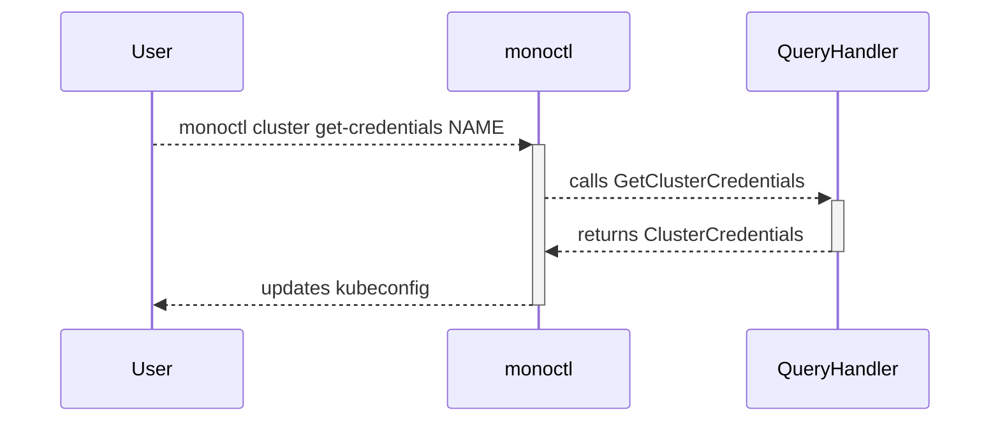

**[[Back To Overview]](..)**

# `monoctl cluster get credentials` flow

```mermaid
sequenceDiagram
    participant U as User
    participant M as monoctl
    participant Q as QueryHandler
    U-->>+M: monoctl cluster get-credentials NAME
    M-->>+Q: calls GetClusterCredentials
    Q-->>-M: returns ClusterCredentials
    M-->>-U: updates kubeconfig
```
