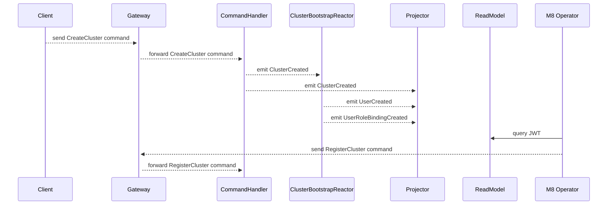

**[[Back To Overview]](..)**

# Create Cluster

The process not only creates an aggregate for the cluster, but also a (machine) user with the DNS name of the cluster as the user name as well as an appropriate role binding.
