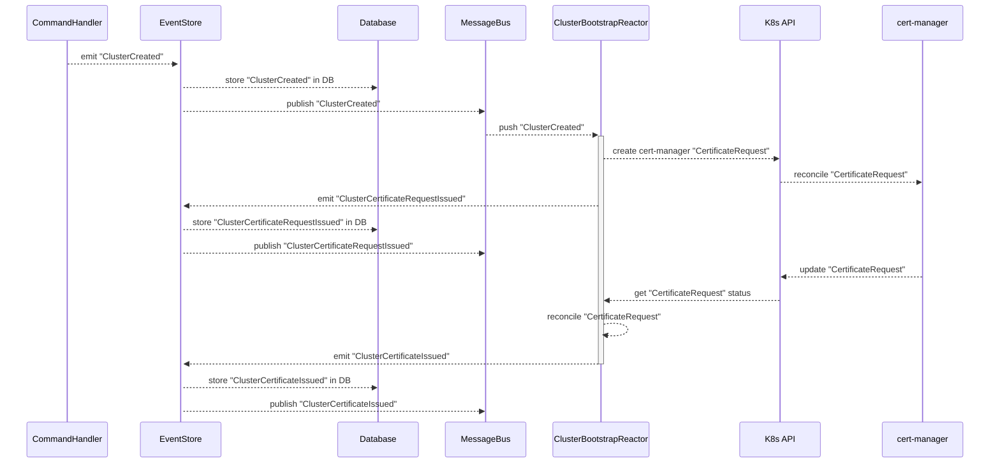

**[[Back To Overview]](.)**

# ClusterBootstrapReactor Certificate Flow

```mermaid
sequenceDiagram
 participant CH as CommandHandler
 participant ES as EventStore
 participant DB as Database
 participant MB as MessageBus
 participant R as ClusterBootstrapReactor
 participant K as K8s API
 participant CM as cert-manager
 
 CH-->>+ES: emit "ClusterCreated"
 ES-->>DB: store "ClusterCreated" in DB
 ES-->>MB: publish "ClusterCreated"
 MB-->>+R: push "ClusterCreated"
 R-->>K: create cert-manager "CertificateRequest"
 K-->>CM: reconcile "CertificateRequest"
 R-->>ES: emit "ClusterCertificateRequestIssued"
 ES-->>DB: store "ClusterCertificateRequestIssued" in DB
 ES-->>MB: publish "ClusterCertificateRequestIssued"
 CM-->>K: update "CertificateRequest"
 K-->>R: get "CertificateRequest" status
 R-->>R: reconcile "CertificateRequest"
 R-->>-ES: emit "ClusterCertificateIssued"
 ES-->>DB: store "ClusterCertificateIssued" in DB
 ES-->>MB: publish "ClusterCertificateIssued"
```
